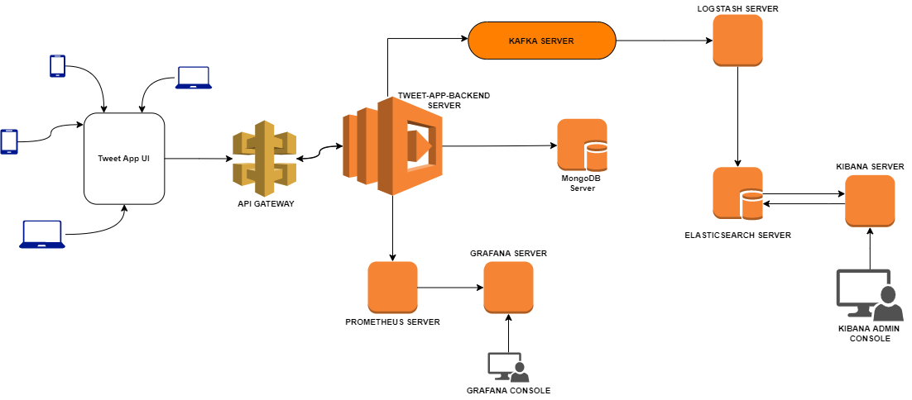

# </> Engineering Requirement Specifications
## Tweet App
| Name | Value |
|--|--|
|Author| Subham Santra |
|Last update| 09, FEB 2022 |
---
### Requirements:
 - Only registered user should be allowed to access the page.
 - User can register themselves by entering unique email id, that means all the registered users should have different mail id.
 - At the time of registration user need to enter answers of some security questions, which will later help the user to recover his/her account if he/she forgets password.
 - User should be allowed to login with his/her registered email id and current password.
 - If user forgets password, then he/she needs to select proper security question and type the correct answer, along with new password.
 - After login user should be redirected to home page.
 - In home page user should be able to see all latest tweets posted by *anyone*.
 - User should be able to navigate to search page, where they can search user profile by name, email and view user's profile.
 - User should be able to add new tweet.
 - User should be able to add comment on any tweet posted by anybody.
 - User should be able to like or dislike any tweet.
#

